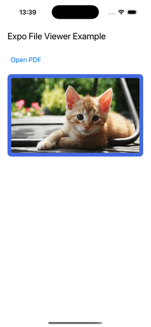

# Expo File Viewer

This is a simple wrapper using QuickLook on iOS and Intents on Android to view files.
Using the native file viewing capabilities of the platform makes previewing files snappy and feature-rich.

## Demo

iOS | Android
--- | ---
 | 

## In Progress

- [ ] Publish to npm
- [ ] Usage documentation
